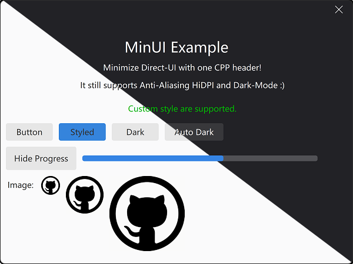
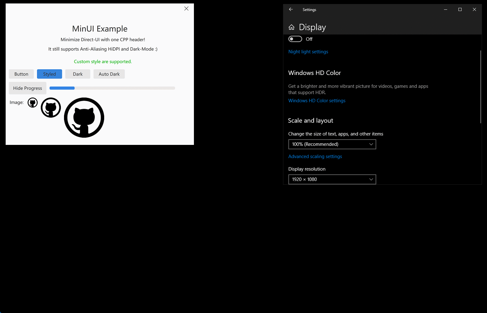

# MinUI
**Minimize GUI library for installer.**

### Overview

An minimize GUI library for installer and small tool. It all in one CPP header file, but still supports:

* Anti-Aliasing
* High-DPI
* Dark-Mode
* Custom-Style

It has these widgets:

* Label: single line text
* Button: simple push button
* Image: simple BMP image view
* Progress: left-to-right progress bar

### Platform

* Windows 10, 11 (tested)
* Windows 7, 8, 8.1 (no-test now)
* Ubuntu 24.04 GNOME (tested)
* CentOS 7 GNOME (tested)

### Dependents

* Windows:  GDI
* Linux: gtk4 gtk3